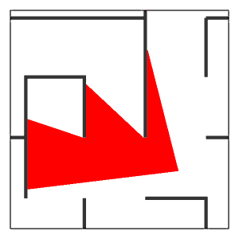
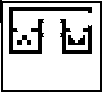
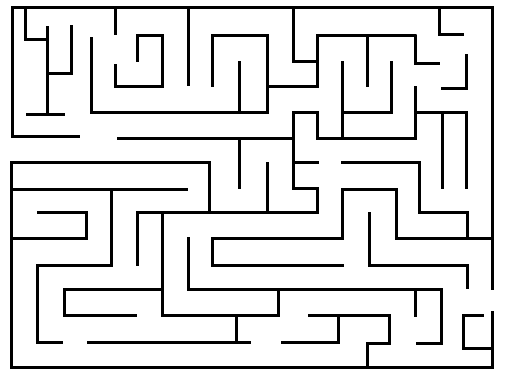

# FPS 3D game engine

[](https://github.com/krisukox/game-engine/actions)
[](https://codecov.io/gh/krisukox/game-engine/tree/master/src)

FPS 3D game engine uses [piston2d-graphics](https://github.com/pistondevelopers/graphics) with [opengl backend](https://github.com/PistonDevelopers/opengl_graphics) to draw 2D objects and gather mouse and keyboard event. All 3D objects are rendered by FPS 3D game engine project using ray casting. Rendering can be devided into multiple threads (up to 4 threads):

CLICK IMAGE TO PLAY

[](ray-cast.gif)

The general purpose of this project is to create engine that can handle any black-white image and turn it to 3D objects.

# Table of Contents  
1. [Tools and dependencies](#tools)  
2. [User documentation](#user)  
3. [Developer documentation](#developer)  

<a name="tools"/>

# Tools and dependencies

**Unit tests** in the project are made with the [Mockall](https://docs.rs/mockall/0.9.1/mockall/) library.

**Code coverage** reporting tool used in the project - [Tarpaulin](https://github.com/xd009642/tarpaulin).

**Other libraries:**  
[image](https://crates.io/crates/image) - load and analyse images  
[piston](https://crates.io/crates/piston) - paint 2D objects and gather mouse and keyboard event  
[lazy_static](https://crates.io/crates/lazy_static) - decrease number of clones in the test cases  
[float-cmp](https://crates.io/crates/float-cmp) - compare floats in the test cases  

<a name="user"/>

# User Documentation

## Controls

Move the player using WASD keys and mouse.  
Exit game using ESC.

## Examples

Example with walls and doors
```
cargo run --example simple --release
```
[](examples/map-simple.png)

Example with the labyrinth map
```
cargo run --example labyrinth --release
```


## Getting Started
```
cargo new --bin start-project
cd start-project
```

Cargo.toml
```
[package]
name = "start-project"
version = "0.1.0"
authors = ["Krzysztof Naglik <krzysztofnaglik96@gmail.com>"]
edition = "2018"

[dependencies]
game_engine_3d = { git = "https://github.com/krisukox/game-engine" }
```

src/main.rs
```
use game_engine_3d::*;
use map_element::*;
use std::path::Path;

fn main() {
    let path = Path::new("path-to-the-image/image.png");
    let resolution = Size {
        width: 1280.0,
        height: 720.0,
    };
    let number_of_rays = 2000;
    let player = Player::new(
        Angle {
            start: Radians::new(std::f64::consts::PI * 3.0 / 4.0),
            end: Radians::new(std::f64::consts::PI * 5.0 / 4.0),
        },
        Coordinate { x: 10.0, y: 10.0 },
        number_of_rays,
    );
    let vertical_angle_value = Radians::new(std::f64::consts::PI * 0.375);
    let wall_height = 5.0;
    let render_threads_amount = 3;

    match WallMap::new(&path, None) {
        Ok(wall_map) => {
            let map = wall_map.get_map();
            let map_elements: Vec<Box<dyn MapElement>> = vec![Box::new(wall_map)];

            let mut engine = Engine::new(
                resolution,
                vertical_angle_value,
                wall_height,
                map,
                player,
                map_elements,
                render_threads_amount,
            );
            engine.start();
        }
        Err(_) => {
            println!("file not found");
        }
    }
}
```

### Engine

**engine:new** function parameters:

| Name | Description | Type | Possible / Optimal values |
|------|-----------|--------|---------------------------|
| resolution | resolution of the screen | Size |  | 
| vertical_angle_value | vertical angle of player view | [Radians](src/player_utils/radians.rs) | [0.25pi, 0.6pi] |
| wall_height | height of walls | f64 | [3, 10] |
| map | area where player is moving and map elements are placed | [Map](src/map.rs) |  |
| player | describes player start position, view angle and number of rays | [Player](src/player_utils/player.rs)  |  |
| map_elements | collection of all map elements that can be rendered | Vec\<[MapElement](src/map_element/map_element.rs)\> | [WallMap](src/map_element/wall_map.rs), [Door](src/map_element/door.rs) |
| render_threads_amount | amounts of the render threads | i64 | [1, 4] |

When engine is created call **engine::start** function.

### Map elements

* [`WallMap`](src/map_element/wall_map.rs) - structure which describes where walls are placed on the game area. It takes path to the image that shows walls locations (top view). Image has to be black(grey) and white. It takes also color of the walls. Default color of the walls is orange.
* [`Door`](src/map_element/door.rs) - structure describes where door is located, opening direction, opening velocity, color of the door and opening area. Location is specified by the Rectangle. Opening direction is specified by the DoorType. Opening velocity is specified by the DoorVelocity. Opening area is specified by the Rectangle.

### Player utils

* [`Player`](src/player_utils/player.rs) - structure is used to describe position, horizontal field of view and number of rays used in the rendering. Position is specified by the Coordinate. Horizontal field of view is specified by the Angle. Number of rays is specified by usize.
* [`Radians`](src/player_utils/radians.rs) - structure describes direction. Valid values [0, 2pi)
* [`Angle`](src/player_utils/angle.rs) - structure contains two radians values: start and end. 

### Other types

* [`Color`](src/map_element/color.rs) - enum used to describe color of walls and doors. Available values: Red, Green, Blue, Yellow, Orange, Pink, Custom. Use custom value to specify own color in [f64; 4](R, G, B, A)
* [`Rectangle`](src/map_element/rectangle.rs) - structure used to specify door position and opening area
* [`DoorType`](src/map_element/door.rs#L143) - enum used to describe door opening direction. Available values: Vertical - door opens along Y axis, Horizontal - door opens along X axis.
* [`DoorVelocity`](src/map_element/door.rs#L124) - enum used to describe door opening velocity. Available values: VerySlow, Slow, Fast, VeryFast.
* [`Coordinate`](src/graph/coordinate.rs) - describes position using f64 values
* [`Point`](src/map_element/point.rs) - describes position using i64 values

<a name="developer"/>

# Developer documentation

### [MapElement](src/map_element/map_element.rs)

MapElement trait has four functions:
* **is_point_in_object** - used in the ray casting. This function checks if point is inside this MapElement.
* **color** - returns color of the object.
* **update** - updates object. Every MapElement is updated at the same time.
* **on_position_update** - is called when position of the player is changed.

### Ray casting

Rays are described by LinearGraph structure. LinearGraph::from_radians takes Radians and generate LinearGraph. All available rays are generated when Engine is created.

Ray casting is performed by map::cast_ray function. It takes ray start position, LinearGraph as a ray and Vector of MapElements. cast_ray function iterate over MapElements and check if in the position any of the elements is placed. map::cast_ray function returns empty vector, one or two ColoredPoints.

### [RenderThread](src/render_thread.rs)

Rays are splited between RenderThreads by a Player::get_rays_angle_range function. This function takes index of the RenderThread and the RenderThreads amount.

Every RenderThread starts rendering when receives notification from the Engine. Notification is a true value sends by the channel. RenderThread sends back rendered Walls to the ObjectGenerator.

Player and MapElements are shared by RwLock across RenderThreads and Engine. Engine modifies Player and MapElements when RenderThreads only read the values.

### [ObjectGenerator](src/generator/object_generator.rs)

ObjectGenerator::generate_polygons function generate polygons using Player and Walls received from the RenderThreads. Single polygon is generated using PolygonGenerator.

### Wrappers

Wrappers prepared in order to improve Engine test cases.

* [`EventsWrapper`](src/wrapper/events_wrapper.rs) - wrapper for piston::event_loop
* [`GraphicsWrapper`](src/wrapper/graphics_wrapper.rs) - wrapper for opengl_graphics::GlGraphics

### Other types

* [`Polygon`](src/generator/polygon.rs) - structure used to describe polygons that should be painted on the screen. PolygonGenerator returns single Polygon.
* [`ColoredPoint`](src/map_element/colored_point.rs) - structure returned by map::cast_ray function.
* [`LinearGraph`](src/graph/linear_graph.rs) - structure used to describe a ray.
* [`MoveHandler`](src/player_utils/move_handler.rs) - structure used to move the Player properly.
